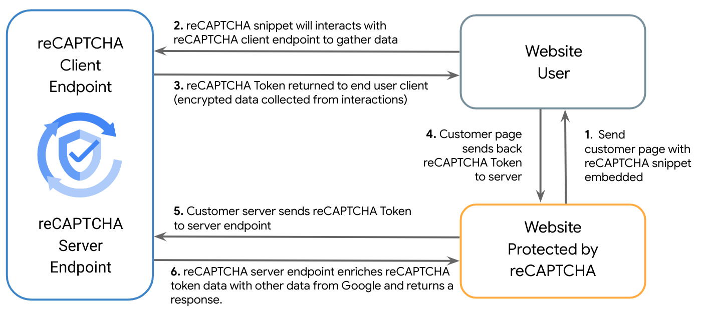

[](https://cloud.google.com/?utm_source=github&utm_medium=referral&utm_campaign=GCP&utm_content=packages_repository_banner)

# Protect your Application from Fraud, Automation, and Bot activity with reCAPTCHA

## Introduction

_This architecture uses click-to-deploy so you can spin up infrastructure and applications in minutes!_

reCAPTCHA leverages a sophisticated and adaptable risk analysis engine to shield against automated software, thwarting abusive activities within an organization’s website and mobile apps. It safeguards your website and mobile applications from abusive traffic without compromising the user experience. reCAPTCHA employs an invisible score-based detection mechanism to differentiate between legitimate users and bots or other malicious attacks.

This click to deploy demo implements reCAPTCHA into an application, and reveals on the web page the results of the API calls made. It demonstrates the key functionality of the product along with some of the advanced protection features.


* __Protection from OWASP Automated Attacks__: 

## Architecture

<p align="center">  </p>

The main components that we would be setting up are (to learn more about these products, click on the hyperlinks):

* [reCAPTCHA](https://cloud.google.com/security/products/recaptcha) - reCAPTCHA is a service that helps to protect your websites and mobile applications from spam and abuse..
* [Cloud Build](https://cloud.google.com/build) - This demo includes an that will be built in Google Cloud Build.
* [Cloud Run](https://cloud.google.com/run) - The demo application will be deployed to Google Cloud using Cloud run, where it can then be used through Cloud Run proxy.

## Costs

reCAPTCHA is billed volumetrically. It functions in two stages, the client side execute which is free, and an API call known as an assessment which is charged.

There are multiple tiers for reCAPTCHA (including a free tier). For more details see [reCAPTCHA Compare Tiers](https://cloud.google.com/recaptcha/docs/compare-tiers)

## Deploy the architecture

Estimated deployment time: 8 mins

1. Click on Open in Google Cloud Shell button below.

<a href="https://ssh.cloud.google.com/cloudshell/editor?cloudshell_git_repo=https://github.com/bigdavros/hero-dev-repo&cloudshell_workspace=/&cloudshell_open_in_editor=README.md" target="_new">
    
</a>

2. Run the script to deploy the demo. You will be prompted for variables by the script.
```
sh deploy.sh
```
## Accessing the demo

1. The deployment script will create a `run.sh` with the following contents, that will differ depending on your project and region
```
gcloud run services proxy recaptcha-demo-service-XXXXX --project PROJECT_ID --region REGION
```

2. Simply run the script with:
```
sh run.sh
```

## Cleaning up your environment
Run the command below on Cloud Shell to destroy the resources. 
```
bash cleanup.sh
```